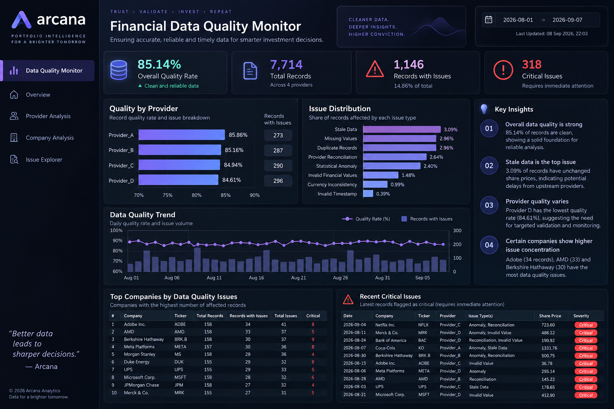

# Financial Data Quality & Reconciliation Monitor

### Candidate Case Study — Synthetic Financial Dataset

A financial data quality monitoring case study focused on identifying, validating and prioritizing data issues across multiple providers.

I built this project after exploring the type of data-quality challenges relevant to financial data platforms, particularly around validation, reconciliation, anomaly detection and monitoring.

> **Note:** This project uses synthetic data and is an independent candidate case study. It is not affiliated with or based on proprietary data from Arcana Analytics.

---

## Business Problem

Financial analytics depend on data that is accurate, complete, consistent and timely.

When financial data is received from multiple providers, quality issues can arise through:

- Missing values
- Duplicate records
- Invalid financial values
- Provider-level inconsistencies
- Statistical anomalies
- Stale data
- Currency inconsistencies
- Invalid ingestion timestamps

The objective of this project was to build a systematic framework to detect these issues and prioritize records requiring attention.

---

## Dataset

The synthetic dataset contains:

- 7,714 financial records
- 50 companies
- 4 data providers
- 38 days of observations
- Share price
- Market capitalization
- Revenue
- Portfolio value
- Currency
- Ingestion timestamp

---

## Data Quality Framework

Each record was evaluated using multiple validation rules.

### 1. Completeness

Identified records containing missing financial values.

### 2. Duplicate Detection

Detected duplicate business-key combinations across:

`Date + Company + Ticker + Provider`

### 3. Financial Validity

Flagged non-positive values for:

- Share price
- Market capitalization
- Revenue
- Portfolio value

### 4. Provider Reconciliation

Compared provider market-cap values against the median across providers and flagged deviations greater than 5%.

### 5. Statistical Anomaly Detection

Used provider/ticker-level price movement and Z-score analysis to identify statistically unusual observations.

### 6. Stale Data Detection

Identified observations where the reported share price remained unchanged from the previous observation.

### 7. Metadata Validation

Checked currency consistency and ingestion timestamp validity.

---

## Key Results

| Metric | Result |
|---|---:|
| Total Records | 7,714 |
| Clean Records | 6,568 |
| Records With Issues | 1,146 |
| Overall Quality Rate | 85.14% |
| Critical Records | 318 |
| Warning Records | 728 |
| Minor Records | 100 |

### Issue Distribution

| Issue | Records | % of Records |
|---|---:|---:|
| Stale Data | 238 | 3.09% |
| Missing Values | 228 | 2.96% |
| Duplicate Records | 228 | 2.96% |
| Provider Reconciliation | 204 | 2.64% |
| Statistical Anomaly | 185 | 2.40% |
| Invalid Financial Values | 114 | 1.48% |
| Currency Inconsistency | 76 | 0.99% |
| Invalid Timestamp | 30 | 0.39% |

> Issue categories can overlap. Therefore, issue counts should not be summed to calculate the number of unique affected records.

---

## Provider Quality

| Provider | Quality Rate | Records With Issues |
|---|---:|---:|
| Provider A | 85.86% | 273 |
| Provider B | 85.16% | 287 |
| Provider C | 84.94% | 290 |
| Provider D | 84.61% | 296 |

---

## Key Findings

### 1. Stale data was the most common detected issue

238 records were flagged as stale, representing 3.09% of the dataset.

### 2. Provider quality varied across sources

Provider D had the lowest quality rate at 84.61%, while Provider A had the highest at 85.86%.

### 3. Provider reconciliation is an important validation layer

204 records exceeded the 5% deviation threshold against the provider-level median market capitalization.

### 4. Multiple issue types can affect the same record

The master quality engine identified 1,146 unique records with at least one issue.

---

## Dashboard



---

## Tools & Technologies

- Python
- Pandas
- NumPy
- Statistical analysis
- Data quality validation
- Anomaly detection
- Power BI
- GitHub

---

## Project Structure

```text
financial-data-quality-monitor/
│
├── README.md
├── notebook/
│   └── FinancialDataQualityMonitor.ipynb
├── dashboard/
│   └── financial_data_quality_dashboard.png
├── data/
│   └── synthetic_financial_data.csv
└── outputs/
    └── quality_analysis.csv
